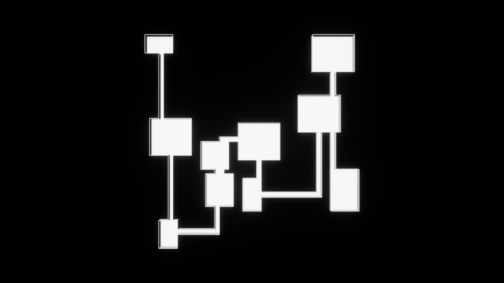

# SeedForge

SeedForge is a deterministic asynchronous dungeon-generation lab for Unreal Engine 5.8. It separates a pure C++ generation/validation core from UE task scheduling and HISM scene application.



## Verified so far

- Explicit `Seed + Config` input with bounded deterministic generation.
- Canonical room/corridor ordering and byte-defined FNV-1a layout hashes.
- Bounds, overlap, entrance/exit, and full-connectivity validation.
- Cancellation-safe `UE::Tasks` execution with newest-request-wins semantics.
- `UWorldSubsystem` lifetime boundary and weak UObject apply callback.
- Pure C++ HISM graybox using only the Engine cube asset.
- 20 UE Automation tests, including 1,000 seeds and 100 asynchronous repetitions.

Packaging and final release evidence are still in progress and are not claimed complete yet.

## Local verification

```powershell
powershell -NoProfile -ExecutionPolicy Bypass -File Scripts/Build.ps1
powershell -NoProfile -ExecutionPolicy Bypass -File Scripts/Test.ps1 -Filter SeedForge
powershell -NoProfile -ExecutionPolicy Bypass -File Scripts/CaptureDemo.ps1
```

The accepted delivery contract, implementation plan, and evidence journal live under `tasks/20260903-113501-ue58-agentic-sprint/`.

## Authorship

This repository is an AI-assisted build produced with Codex GPT-5.6 Sol under a user-approved specification. The final handoff will document the generated implementation, verification evidence, and limitations rather than presenting it as independently hand-written code.
