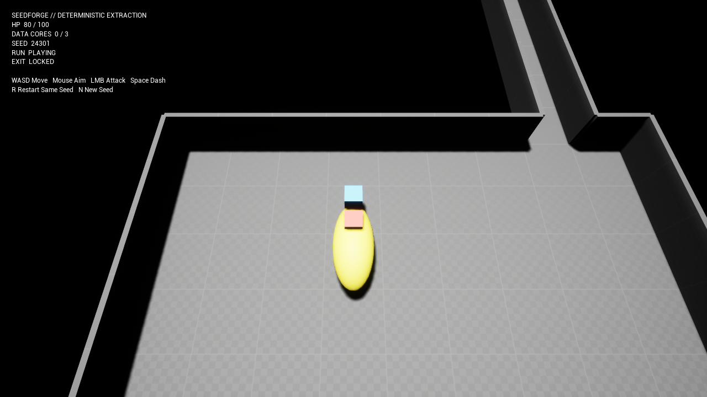

# SeedForge 0.3.0

SeedForge is a UE 5.8 C++ engineering portfolio project: a deterministic procedural dungeon becomes a short, playable top-down extraction run, with local evidence from pure-model tests through a real Win64 packaged executable.



```text
Seed + Config
  -> Deterministic Layout
  -> Deterministic Encounter Plan
  -> Grid A*
  -> UE Gameplay World
  -> Collect / Fight / Extract
  -> Automated Packaged Evidence
```

## What you can play

- Generate one dungeon and a separately versioned initial encounter from `-SeedForgeSeed=<uint64>`.
- Move with WASD, aim with the mouse, attack with Left Mouse Button, and dash with Space.
- Fight five bounded-A* enemies, collect three Data Cores, unlock the exit, and extract.
- Lose all HP, then press R to restart the same seed or N to start a deterministic next seed.
- Read HP, Core progress, exact seed, run state, exit state, controls, and terminal prompts in the code-native HUD.

The map and initial encounter are reproducible for the same Seed + Config. The complete real-time run is not claimed deterministic across input timing, frame rate, or floating-point physics.

## Independent-audit checkpoints

| Boundary | Latest observed checkpoint |
|---|---:|
| UE Automation | 119 passed, 0 test/whole-log warnings, 0 failures (development checkpoint) |
| Preserved 0.2.0 baseline | original 41 tests and five layout golden hashes remain green |
| Encounter plan | player, exit, 3 Cores, 5 enemies; stable IDs/cells/hash; typed failures |
| Grid A* | four-neighbor, Manhattan, fixed tie-break, bounded expansions, typed statuses |
| Gameplay smoke | real A* movement before capture; attack, kill, 3 pickups, unlock, `Playing -> Won`; 3 decoded PNGs |
| Ordinary input | UE viewport/input dispatch proves WASD, aim, attack, diagonal Dash, loss, same/new/rapid restarts |
| Independent plugin | Editor Development, Game Development, Game Shipping |
| Win64 candidate | clean `a9f5625`: Build/Cook/Stage/Pak/Archive, ordinary input, gameplay, all 4 negative processes, archive rehash |

These are explicitly separate checkpoints, not a claim that the current documentation commit has already passed all 16 final gates. The latest package is bound to `a9f56254f11554316302936926211e75d86d7f4d`; the 119-test development report and earlier three-target BuildPlugin have their own recorded revisions. The original 63-test delivery is historical, not the audit's final authority.

Generated evidence stays under ignored `Artifacts/`; the [independent audit journal](tasks/20260904-102407-phase3-independent-release-audit/progress.md) preserves RED/GREEN, failed attempts and exact checkpoint paths. `VerifyPhase3.ps1` produces `MachinePassed` for one clean revision with a frozen evidence index. Original-resolution visual review and fresh PR/remote review are separately required by `FinalizeRelease.ps1`. Current publication status comes from [Release notes](docs/RELEASE_NOTES.md) and the GitHub Release, never from an old `last-*` file.

## Run and verify

```powershell
# Build and run all deterministic/UE contracts
.\Scripts\Build.ps1
.\Scripts\Test.ps1 -Filter SeedForge

# Exercise ordinary input and real async restarts, without the gameplay-smoke driver
.\Scripts\TestInputSelfTest.ps1 -Seed 24301

# Observe real A* movement, then attack/collect/extract and rendered captures
.\Scripts\TestGameplay.ps1 -Seed 24301

# Build one Win64 package; run ordinary input, gameplay and four negative cases
.\Scripts\PackageGameplay.ps1 -Seed 24301

# One clean-revision machine run; visual/remote review remains a separate gate
.\Scripts\VerifyPhase3.ps1
```

For ordinary play, launch the packaged `Windows/SeedForge.exe`. Pass `-SeedForgeSeed=24301` or another unsigned 64-bit seed. The normal path does not depend on the smoke flag.

Use PowerShell 7 for the native process wrappers. Default verification entry points require committed, clean source. For development only, Build/Test/TestGameplay/TestInputSelfTest/TestRunFailure accept explicit `-AllowDirtyDiagnostic`; diagnostic results cannot certify release artifacts. Input uses named Action/Axis mappings on Enhanced-compatible classes, not Input Action/Mapping Context assets.

Release distribution is source-only: GitHub's default source ZIP/tarball, with no plugin/demo binary assets uploaded. Local native packaging remains mandatory evidence.

## Architecture at a glance

```text
FSeedForgeGenerator (layout v1, preserved)
  -> USeedForgeWorldSubsystem (worker + newest-request-wins apply)
  -> ASeedForgeGameplayCoordinator (one run owner)
       -> FSeedForgeEncounterPlanner (pure deterministic values)
       -> FSeedForgeRunStateMachine (explicit fail-closed transitions)
       -> ASeedForgePreviewActor (HISM floors/walls + collision)
       -> Player / Enemy / Core / Exit / HUD actors
       -> FSeedForgeGridPathfinder (bounded deterministic A*)
       -> AHUD-owned Slate + render-owned capture receipts
       -> Ordinary input / passive path proof + JSON + process status
```

The 0.2.0 evidence layer remains intact: canonical layout JSON, strict import, structural Layout Diff, benchmark Commandlet, and the Slate Inspector all consume the same Runtime layout APIs.

Read [Phase 3 architecture](docs/PHASE3_ARCHITECTURE.md), [gameplay loop](docs/GAMEPLAY_LOOP.md), [code walkthrough](docs/PHASE3_CODE_WALKTHROUGH.md), [acceptance matrix](docs/PHASE3_ACCEPTANCE_MATRIX.md), and [known limitations](docs/KNOWN_LIMITATIONS.md).

## Honest portfolio use

Codex GPT-5.6 Sol implemented, tested, debugged, packaged, and documented SeedForge under constraints and acceptance goals supplied by the user. The user did not independently hand-write this implementation. Present it as an AI-assisted engineering project, reproduce the evidence, understand the trade-offs, and complete personal test-first modifications before claiming coding ownership. See [AI assistance](docs/AI_ASSISTANCE.md), [Phase 3 interview guide](docs/PHASE3_INTERVIEW_GUIDE.md), and [live change drills](docs/LIVE_CHANGE_DRILLS.md).

SeedForge remains a focused single-player graybox, not a production game or general procedural framework.

## License

MIT. See [LICENSE](LICENSE).
